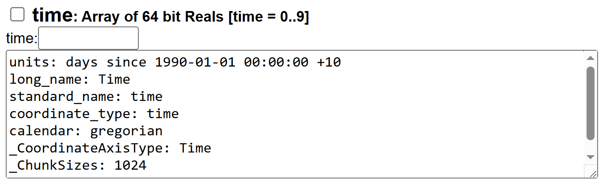

# eReefs climatology as GeoTiffs
This script contains scripts for generating aggregate eReefs data products. eReefs is useful for understanding the spatial distribution of environmental attributes, such as salinity, temperature, currents, etc. While eReefs provides a full time series estimate of these environmental conditions we often just want a climatology value for each location to indicate the spatial differences in these conditions. This dataset aims to provide an estimate of the average conditions for each of the key eReefs environmental conditions.

It also serves as an example of how to process the data from regridded aggregate AIMS THREDDS data. The primary script `01-ereef-full-time-series-average-geotiff` was implemented in both R and Python. Both versions produce the analysis products. 

This repository also contains `01-download-monthly-bgc-data.R` which is an example of downloading monthly data from the BGC model for specific variables and a particular depth value, and saving the result as a NetCDF file with all the original metadata. This script is not used in the climatology calculations, but is retained as reference code.

This code uses the [AIMS eReefs Thredds data service](https://thredds.ereefs.aims.gov.au/thredds/catalog/catalog.html) to download the data using the OPeNDAP service.

## Using R 
1. Load the script `01-download-ereefs-data.R` into RStudio. 
2. Install any required packages.
3. Set the working directory to the folder corresponding to the `01-download-ereefs-data.R` script. Use the Files tab to navigate to the script folder, the using the `More / Set As Working Directory`. If you know what the directory path is you can also use the `setwd` command directly in the Console such as:
```R
setwd("~/2025/ereefs/GBR_AIMS_eReefs-climatology_2025")
```
3. Run the download script
```R
source("01-ereefs-full-time-series-average-geotiffs.R")
```

## Setting up Python
1. Create the Conda environment. 
```bash
cd {path to the GBR_AIMS_ereefs-climatology_2025 dataset} 
conda env create -f environment.yml
```
2. Activate the environment
```bash
conda activate ereefs-climate
```
3. Run the code:
```bash
python 01-ereefs-full-time-series-average-geotiffs.py
```
This should take approximately 45 min.

## Notes
If you had a failure during a run (i.e a Thredds timeout) then you can resume the calculations and it will skip over any previously calculated outputs. 

If any code changes are made that will affect existing outputs, you need to delete the existing outputs prior to running the code, because it will skip over reprocessing stages where there are existing outputs.

# Lessons
## Dealing with time slices can be tricky due to time zones
In this script we combine together multiple annual average estimates for each variable and depth. While the annual data represents a time period from the 1 Jan to the 31 Dec of a particular year this can not be well represented in a NetCDF file. Each time slice is represented with just a single date, with no direct indication from the time dimension as to the period that the time slice represents. In the raw eReefs model data (available through NCI) the time slices in the data represent an actual instant in time, not a time period. In the regridded temporal aggregate datasets provided through the AIMS eReefs Thredds service each product is an average of the raw eReefs time slices over a particular period. For the hydrodynamic model the raw time samples are 1 hour. Twenty four of these are combined to create the daily average. In this way the aggregate now represents the average of a period, rather than a time snapshot. The monthly data is a combination of 24 hr x ~30 days, and thus represents a month period. In the AIMS service the only data product that doesn't correspond to a time period is the daily BGC product, because the input raw eReefs BGC data is a daily snapshot and so the output from the AIMS service is also a daily snapshot. In the NetCDF file these periods are still recorded as a single time and the period must be worked out from knowing that the data corresponds to a daily, monthly or annual period. In each of these cases the time recorded for each time period corresponds to the start of the period, and thus a monthly average that represents 1 Jan 2012 - 31 Jan 2012 is recorded with the time slice of 1 Jan 2012. One complication to this is that all times are recorded in UTC time. All the data corresponds to Queensland local time, which has a time zone of UTC+10. As a result the UTC times are 10 hours behind local time. This means that our Jan 2012 month example would be recorded as 31 Dec 2011 14:00. 

Because of the time offset from the time zone adjustments then it is easy to get the wrong time period. 

Another complication when dealing with the time dimension is that the time in the NetCDF file is recorded as number of days relative to a reference date. The time is recorded as a floating point number, not in a format that can easily be read as a date. 

### Python time handling
See `02-lessons-examples.py`. In Python the xarray library seems to automatically pick up the time units and convert the time dimensions.

```python
import xarray as xr

ds = xr.open_dataset("https://thredds.ereefs.aims.gov.au/thredds/dodsC/GBR4_H2p0_B3p1_Cq3b_Dhnd/annual.nc")
print(f"Dataset time values (UTC): {ds.time.values}")
```
Prints the following for the BGC v3.1 for the annual aggregate product:
```
Dataset time values (UTC): ['2009-12-31T14:00:00.000000000' '2010-12-31T14:00:00.000000000'
 '2011-12-31T14:00:00.000000000' '2012-12-31T14:00:00.000000000'
 '2013-12-31T14:00:00.000000000' '2014-12-31T14:00:00.000000000'
 '2015-12-31T14:00:00.000000000' '2016-12-31T14:00:00.000000000'
 '2017-12-31T14:00:00.000000000' '2018-12-31T14:00:00.000000000']
 ```
Here we can see that the time values have been converted to date strings in a standard format that is easy to convert to a date time object. The dates are also in UTC time.

To ensure we get the correct year we need to shift the time from UTC to local time. Otherwise we will get the previous year. 
```Python
import pandas as pd

# Convert to local time
local_time = [pd.Timestamp(t) + pd.Timedelta(hours=10) for t in ds.time.values]

# Extract the years
years = [pd.Timestamp(t).year for t in local_time]
print(f"Years: {years}")
```
Prints:
```
Years: [2010, 2011, 2012, 2013, 2014, 2015, 2016, 2017, 2018, 2019]
```
### R time handling
See `02-lessons-examples.R`. In R the ncdf4 does not automatically convert the time dimension values to date time strings, but instead provides them in their raw form from the NetCDF file.
```R
library(ncdf4)   # For handling NetCDF files
nc <- nc_open("https://thredds.ereefs.aims.gov.au/thredds/dodsC/GBR4_H2p0_B3p1_Cq3b_Dhnd/annual.nc")
time_var <- ncvar_get(nc, "time")
cat(sprintf("Time variable values: %s\n", paste(time_var, collapse = ", ")))
```
Outputs:
```
Time variable values: 7305, 7670, 8035, 8401, 8766, 9131, 9496, 9862, 10227, 10592
```
We can see that this matches the [time dimension values](https://thredds.ereefs.aims.gov.au/thredds/dodsC/GBR4_H2p0_B3p1_Cq3b_Dhnd/annual.nc.ascii?time%5B0:1:9%5D) from the [OPeNDAP service page](https://thredds.ereefs.aims.gov.au/thredds/dodsC/GBR4_H2p0_B3p1_Cq3b_Dhnd/annual.nc.html)

```
Dataset {
    Float64 time[time = 10];
} GBR4_H2p0_B3p1_Cq3b_Dhnd/annual.nc;
---------------------------------------------
time[10]
7305.0, 7670.0, 8035.0, 8401.0, 8766.0, 9131.0, 9496.0, 9862.0, 10227.0, 10592.0
```

To correctly interpret these values we need to know the reference date and units associated with the time dimension. On the OPeNDAP page we can see that the units are units: days since 1990-01-01 00:00:00 +10.

This indicates the starting date and the time zone. 

We can get this starting date in R using:
```R
time_units <- ncatt_get(nc, "time", "units")$value
cat(sprintf("Time units: %s\n", time_units))
```
This will print:
```
Time units: days since 1990-01-01 00:00:00 +10
```
This is just a string and so we need to parse this string to correctly interpret the date. 

#### Robust time conversion
To robustly handle the time conversion we need to first parse the time units string, taking into account that it units could be 'seconds', 'minutes' or 'days' and the time may have a time zone, or not. There a quite a few edge cases to handle. An example implementation of this is the `convert_netcdf_time()` function `time-functions.R`. This function took approximately 90 lines of code. While this function is more adaptable to different NetCDF files the eReefs files are consistent in format and thus this approach is overkill.
```R
# This is an example of how to robustly handle the time conversion
# For this we must consider the time units and the timezone
# Most of the complexity is in the convert_netcdf_time function.
source("time-functions.R", local = TRUE)
# Convert to timezone-aware date-time objects based on the time units
date_time <- convert_netcdf_time(time_var, time_units)
cat(sprintf("Converted date-time values: %s\n", paste(date_time, collapse = ", ")))
# Convert to local time (UTC+10)
local_times <- format(date_time, tz="Australia/Brisbane")
# Extract years as numeric values
years <- as.numeric(format(as.POSIXct(local_times, tz="Australia/Brisbane"), "%Y"))
cat("Local times (UTC+10):", paste(local_times, collapse=", "), "\n")
cat("Years:", paste(years, collapse=", "), "\n")
```
Prints:
```
Converted date-time values: 2009-12-31 14:00:00, 2010-12-31 14:00:00, 2011-12-31 14:00:00, 2012-12-31 14:00:00, 2013-12-31 14:00:00, 2014-12-31 14:00:00, 2015-12-31 14:00:00, 2016-12-31 14:00:00, 2017-12-31 14:00:00, 2018-12-31 14:00:00
Local times (UTC+10): 2010-01-01, 2011-01-01, 2012-01-01, 2013-01-01, 2014-01-01, 2015-01-01, 2016-01-01, 2017-01-01, 2018-01-01, 2019-01-01 
Years: 2010, 2011, 2012, 2013, 2014, 2015, 2016, 2017, 2018, 2019 
```

#### Super simple time conversion
In this dataset we simply need to know the years of each of the time slices. Looking at the time units of each of the models, but looking at one of the NetCDF files of each model we find that all eReefs models use the same time units of 'days since 1990-01-01 00:00:00 +10'. This means that we can calculate the years based on this assumption. To ensure we only process files where this assumption is true we should check that the time units matches our assumptions.
```R
assumed_time_units <- "days since 1990-01-01 00:00:00 +10"

# Fail if time units doesn't match
if (time_units != assumed_time_units) {
    stop(sprintf("Assumed time units '%s' do not match actual time units '%s'", 
                 assumed_time_units, time_units))
}

# Since we only want the year value and we know the units are days 
# and the day values are in local time we can just adjust the starting
# date by the time_var (in days).
year = round(1990 + time_var/365.25)
cat(sprintf("Years: %s\n", paste(year, collapse = ", ")))
```
Prints:
```
Years: 2010, 2011, 2012, 2013, 2014, 2015, 2016, 2017, 2018, 2019
```